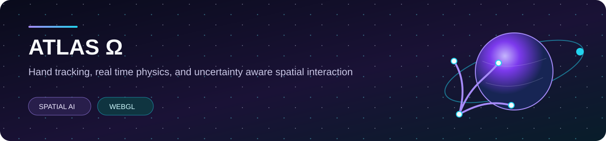
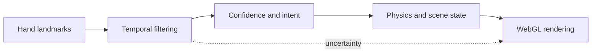

  

  
  
  

Atlas Omega explores how hand tracking, real time physics, and WebGL can form a
spatial interface without hiding uncertainty in the underlying perception.

The project preserves two working experiments while a more rigorous planetary
observatory architecture is designed around reproducible input, visible
confidence, and clear separation between observation and presentation.

## The question

> How can uncertain perception drive an expressive interactive system without
> pretending that every estimate is correct?

The visible effect is only the final layer. A trustworthy spatial system must
keep the original observation, interpretation, simulated state, and rendered
output distinguishable.

## System boundary

## Preserved experiments

| Component | Current role |
| --- | --- |
| V2 hand tracking experiment | Temporal filtering and landmark driven interaction |
| V3 compositor | Physics, scene composition, and visual effects |
| MediaPipe Tasks Vision | Hand landmark estimation |
| Three.js | Real time spatial rendering |
| Rapier | Physics components |
| Deterministic demo mode | Repeatable review without requiring a camera |

## Engineering principles

1. Observation is not interpretation.
2. Interpretation is not simulation.
3. A rendered effect is not proof that perception was correct.
4. Confidence and failure states belong in the interface.
5. Replay must be deterministic before behavior can be compared reliably.

## Verified state

The private source baseline passed its JavaScript syntax check and HTTP smoke
check on 29 July 2026. The V3 experiment also rendered successfully in a browser.

This verifies that the preserved experiment runs. It does not claim that the
future observatory is complete or that the current perception behavior has been
scientifically validated.

## Known constraints

1. Camera and demo modes do not yet share one reproducible input contract.
2. Confidence and uncertainty are not fully surfaced in the interface.
3. Occlusion and rapid motion can destabilize landmark interactions.
4. Replay and evaluation need stronger separation from rendering.
5. The planetary observatory remains a direction, not a completed instrument.

## Public and private boundary

This public repository is a project case study and evidence boundary. It does
not contain runnable source. The complete development repository remains private
while model, texture, dataset, and source provenance are reviewed.

No open source license is granted at this stage.

## Roadmap

1. Define typed observation and uncertainty records.
2. Introduce deterministic replay fixtures.
3. Separate perception, interaction, physics, and rendering modules.
4. Add measurable hand tracking stability benchmarks.
5. Complete provenance and licensing review for distributed assets.
