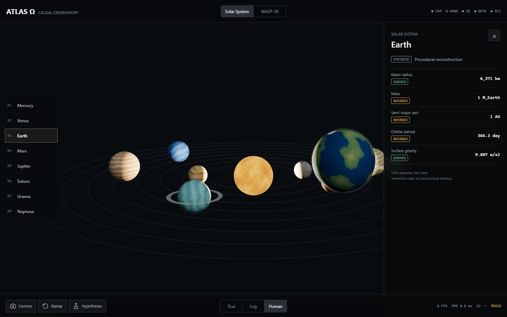
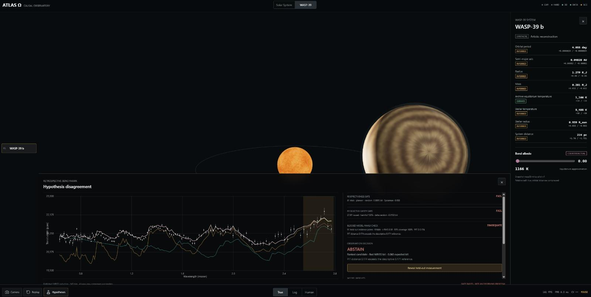
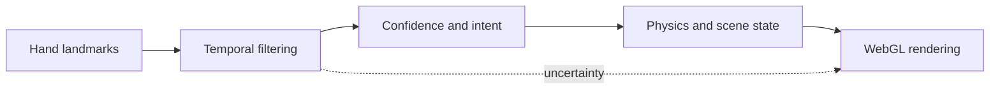

<p align="center">
  
</p>

<p align="center">
  
  
  
</p>

Atlas Omega explores how hand tracking, real time physics, and WebGL can form a
spatial interface without hiding uncertainty in the underlying perception.

The project preserves two working experiments while a more rigorous planetary
observatory architecture is designed around reproducible input, visible
confidence, and clear separation between observation and presentation.

## The question

> How can uncertain perception drive an expressive interactive system without
> pretending that every estimate is correct?

The visible effect is only the final layer. A trustworthy spatial system must
keep the original observation, interpretation, simulated state, and rendered
output distinguishable.

## Provenance as an interface element

<p align="center">
  
</p>

Every quantity the observatory displays is tagged with where it came from.
`SYNTHETIC` marks a procedural reconstruction, `DERIVED` marks a value computed
from others, `INFERRED` marks an estimate, and each carries its own asymmetric
uncertainty bounds. A radius and a guess never render identically.

This is the same discipline the hand tracking work needs, moved somewhere it is
easier to see. A landmark estimate and a confirmed gesture are as different as
a measured radius and an inferred mass, and an interface that renders them
alike is lying by omission.

### Abstention is a supported outcome

The panel above the spectrum is a retrospective benchmark on a held-out
measurement. Three checks run before the system is allowed to recommend an
observation: an effectiveness gate, a selective-safety gate, and a
model-family adequacy check.

In the run shown, the first two **fail** and the third returns **inadequate**,
because the calibration distance exceeds its descriptive reference. The system
does not fall back to a best guess. It returns:

```
OBSERVATION DECISION:  ABSTAIN
GATE FAILED — NOT AN OBSERVING PROPOSAL
```

Telescope time is the scarce resource this would be spending. A ranked
candidate the model cannot justify is worse than no candidate, because it looks
like an answer. Abstention had to be a first-class result rather than an error
path, and the interface has to render a refusal as clearly as it renders a
recommendation.

The interface renders and is interactive. That makes it a working prototype,
not a validated scientific instrument, and the distinction is kept in the
product rather than in a disclaimer.

## System boundary



## Preserved experiments

| Component | Current role |
| --- | --- |
| V2 hand tracking experiment | Temporal filtering and landmark driven interaction |
| V3 compositor | Physics, scene composition, and visual effects |
| MediaPipe Tasks Vision | Hand landmark estimation |
| Three.js | Real time spatial rendering |
| Rapier | Physics components |
| Deterministic demo mode | Repeatable review without requiring a camera |

## Engineering principles

1. Observation is not interpretation.
2. Interpretation is not simulation.
3. A rendered effect is not proof that perception was correct.
4. Confidence and failure states belong in the interface.
5. Replay must be deterministic before behavior can be compared reliably.

## Verified state

The private source baseline passed its JavaScript syntax check and HTTP smoke
check on 29 July 2026. The V3 experiment also rendered successfully in a browser.

This verifies that the preserved experiment runs. It does not claim that the
future observatory is complete or that the current perception behavior has been
scientifically validated.

## Defects found in my own code

Before designing the observatory, I audited the legacy experiments rather than
building on top of them. Six defects were confirmed and located. They are listed
here because a system that claims to surface uncertainty should start by
surfacing its own.

| # | Defect | Consequence |
| --- | --- | --- |
| 1 | The V3 segmentation mask is sampled through camera, particle, orb, and landmark transforms that are mutually incompatible | Occlusion and silhouette effects cannot all be aligned at once. Some were always wrong |
| 2 | Millisecond timestamps are passed to a One Euro filter whose delta is treated as seconds | The intended smoothing was effectively disabled. The filter was present and doing nothing |
| 3 | Camera retry can leave multiple permanent animation loops running | Compounding frame cost after any camera failure |
| 4 | Camera, playback, and hand-model failures are all reported as `CAMERA BLOCKED` | The error message is not trustworthy, which makes field diagnosis unreliable |
| 5 | Fluid and physics bounds are built from the initial viewport and never rebuilt on resize | Physics silently diverges from what is on screen after a window change |
| 6 | The GPU update is not leapfrog integration, and random initialization plus a concurrent loop means the step function is not a deterministic replay | Runs cannot be compared to each other, which invalidates before and after measurement |

Defect 2 is the one worth dwelling on. The filter was imported, configured, and
called on every frame. Nothing errored, nothing looked broken, and the smoothing
it was supposed to provide never existed. A unit mismatch across a boundary
produces silence, not a stack trace, which is the argument for typed observation
records rather than raw numbers crossing module edges.

Defect 6 is why deterministic replay sits at the top of the roadmap. Without it,
every claim about stability is an impression rather than a measurement.

## Model provenance

Four local model files were inherited from the legacy experiments. Their
filenames and API usage indicate MediaPipe and TensorFlow Lite origins, but the
original download URLs, licenses, and versions were never recorded.

| File | Bytes | SHA-256 (first 16) | Status |
| --- | ---: | --- | --- |
| `hand_landmarker.task` | 7,819,105 | `fbc2a30080c3c557` | Runtime asset, provenance review pending |
| `pose_landmarker_lite.task` | 5,777,746 | `59929e1d1ee95287` | Legacy only, provenance review pending |
| `face_landmarker.task` | 3,758,596 | `64184e229b263107` | Legacy only, provenance review pending |
| `deeplabv3.tflite` | 2,780,051 | `9711334db2b01d58` | Legacy segmentation, provenance review pending |

They are preserved so the legacy demos stay reproducible. They are not described
as first-party models and are not redistributed. Any model the observatory
adopts going forward has to arrive with a source URL, license, version,
checksum, expected input, output semantics, and documented failure mode.

## Known constraints

1. Camera and demo modes do not yet share one reproducible input contract.
2. Confidence and uncertainty are not fully surfaced in the interface.
3. Occlusion and rapid motion can destabilize landmark interactions.
4. Replay and evaluation need stronger separation from rendering.
5. The observatory renders as an interactive prototype; it is not a validated
   scientific instrument and no result from it should be cited as one.

## Public and private boundary

This public repository is a project case study and evidence boundary. It does
not contain runnable source. The complete development repository remains private
while model, texture, dataset, and source provenance are reviewed.

No open source license is granted at this stage.

## Roadmap

1. Define typed observation and uncertainty records.
2. Introduce deterministic replay fixtures.
3. Separate perception, interaction, physics, and rendering modules.
4. Add measurable hand tracking stability benchmarks.
5. Complete provenance and licensing review for distributed assets.
